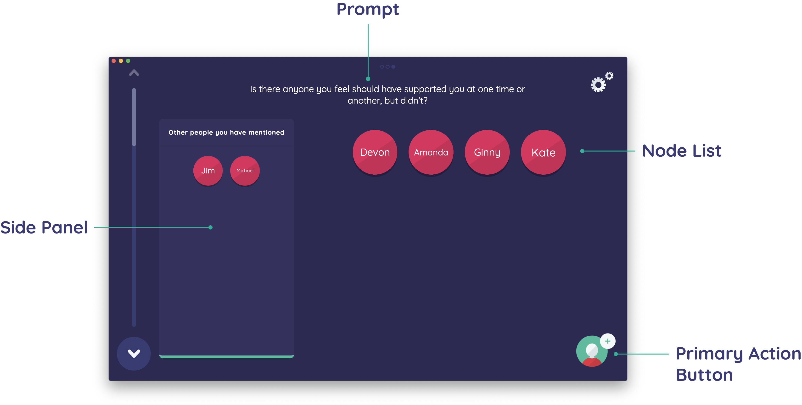

Name Generators are one of the fundamental components of a network interview. They allow your participant to create alters, thereby describing one of the two main entities in your study's networks.

There are four name generator [Interfaces](../reference/key-concepts/interfaces.md) in Network Canvas that can be added to your study, all of which can be configured within Architect.

{:standalone}

Each of these Interfaces is designed for a specific type of alter elicitation, with several associated advantages and disadvantages. Although they have some configuration options that are [shared with all other Network Canvas Interfaces](./shared.md), this article will focus on options specific to the main name generator interface, and a variant of it that uses a 'quick add' mode.

Using roster data in your study? Refer to our documentation on the [small roster name generator](../small-roster-name-generator) or [large roster name generator](../large-roster-name-generator).
{: .tip-box}

## Shared Interface Elements

Both the "Name Generator (Using Forms)" and the "Name Generator (Quick Add)" Interfaces share some common visual elements.

The **prompt** area, where the task is explained to the participant (see: [prompts](../reference/key-concepts/prompts.md)), a **node list** area where alters that have been elicited are displayed, a **primary action button** that triggers the node elicitation process, and (optionally) one or more [Side Panels](#side-panels).

Beyond this, you have a choice about how precisely alters should be created - either using a full featured form, or using a simple "quick add" method.

### Side Panels

Both of these name generators can use Side Panels. Side panels are a powerful feature that allows you to use network data from either the in-progress interview or from a network data file uploaded to your Architect resource library to assist with name generation activities.

For example, when multiple prompts within a name generator have potential overlap in a participant's social network, it may be useful to bring nodes previously nominated onto a subsequent screen so that a participant can easily list them again.

{:standalone}

A side panel can also be created using a network data file (e.g. a roster) to allow a participant to select and nominate alters from a predetermined list. It is important to note that the exact same list will appear on subsequent side panels within the name generator unless a rule(s) is created to filter the data to be shown on the panel (see [network filtering](../reference/key-concepts/filtering.md)).

Side panels can be expanded or contracted in the interview by clicking on the heading.

## Using Forms

When using the "Name Generator (using forms)" Interface, the primary action button will trigger a form that participants must complete to create an alter. This form can include one or more fields to capture specific attribute data on each node (see our [key concepts article on forms](../reference/key-concepts/forms.md) for further information on creating a form). This interface therefore combines the process of generating alters with the ability to do some basic attribute collection, or name interpreting, tasks.

{:standalone}
