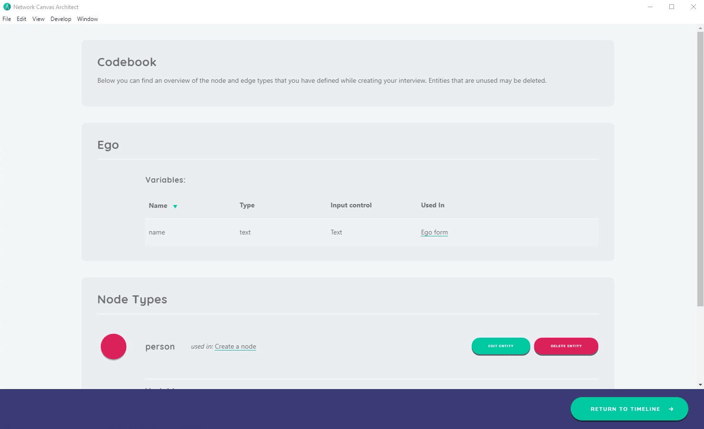
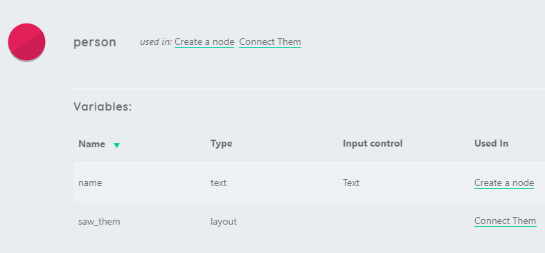
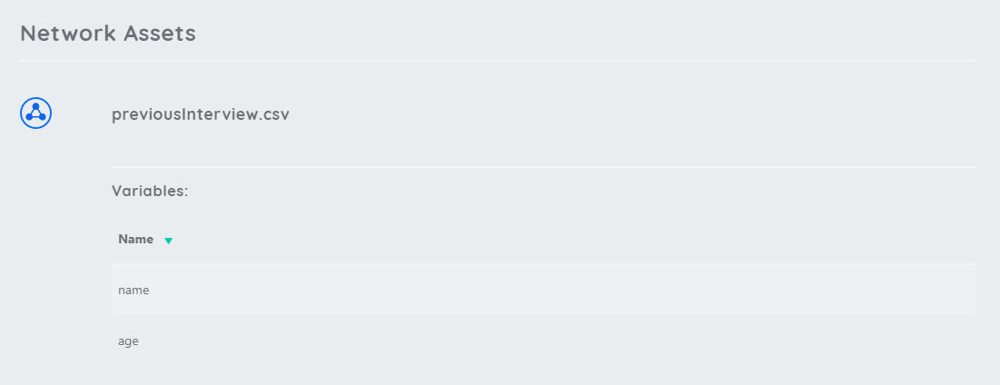

The protocol's codebook gives an overview of the entities and variables defined for the protocol. Architect automatically constructs the codebook as you create variables in a protocol. The codebook can be visualized in the codebook view. To access the codebook in Architect, click on the "Manage codebook" button at the top of a protocol file.

{:standalone}

## Entity Types

The codebook organizes entities by entity type -- Ego, Node, and Edge, and organizes variables by entity. Node and edge types can be edited from the codebook using the "Edit Entity" button. Each node and edge type lists the stages that they are used on, and you can navigate to those stages by clicking on one of the "used in" stage names.

{:standalone}

## Variables

Each variable lists the name, type, input control, and where it is used. You can navigate to any of the stages a variable is used in by clicking on one of the "used in" stage names just like the entity types.

{:standalone}

If a variable is defined but later becomes obsolete, you can see this as an unused variable within the codebook, marked "not in use". Only variables that are unused can be deleted from the codebook. Entity types can also only be deleted if they are unsused in the protocol.

{:standalone}

## Network Assets

Codebooks also contain a summary of Network Assets when [external network data](./resources.md/#network) has been included in a protocol. The heading row of network data will be used as the variable names, and codebook lists these variable names as a summary for each external network asset.

{:standalone}
