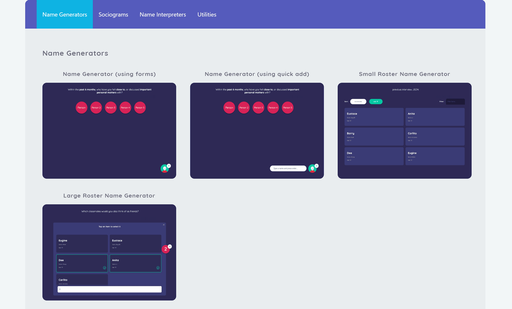
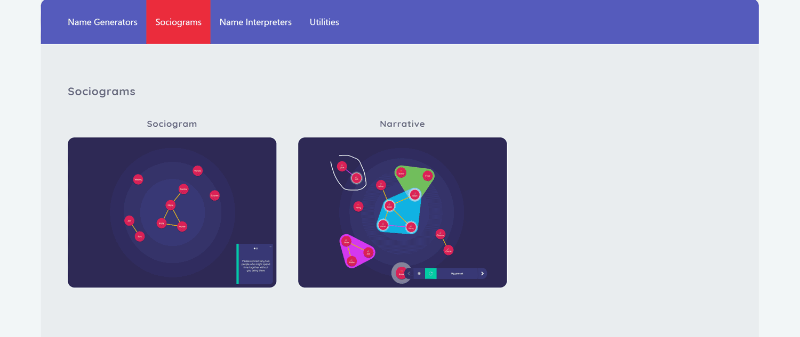
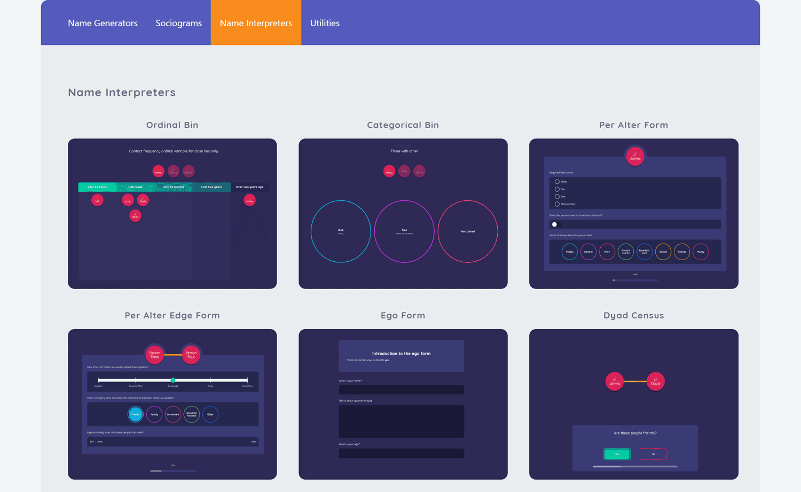
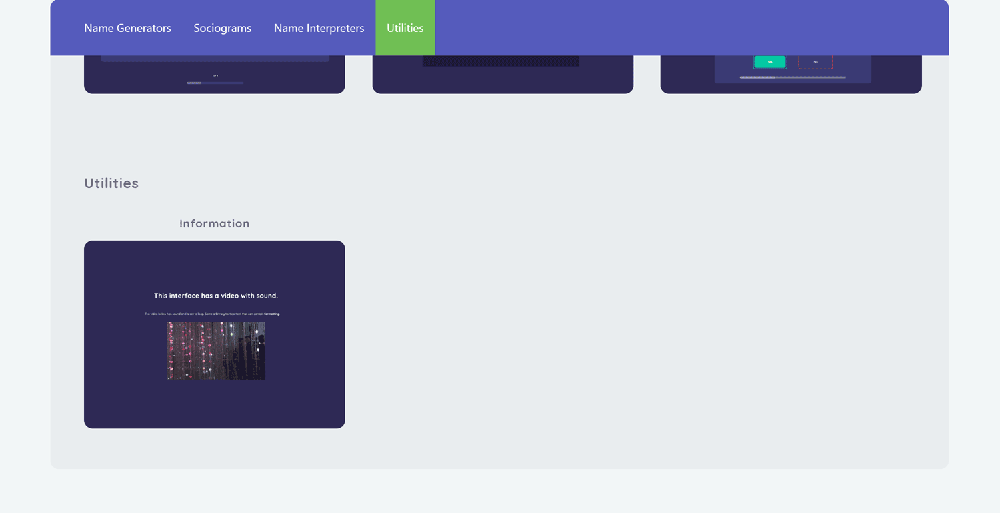

Interviews in Network Canvas are comprised of one or more 'stages', which can be thought of as the individual screens that a participant sees. Each stage is an _instance_ of an 'Interface', which has been configured to collect specific variables, or create nodes/edges. Interfaces are therefore the most fundamental building blocks of a Network Canvas interview.

Each Interface is designed to accomplish a single specific task in the network interview. Some tasks, such as edge generation, can be accomplished with different interfaces. Which interface you choose when designing your interview in Architect is entirely up to you.

## Types of Interfaces

Interfaces can be broadly categorized as: name generators, edge generators, name interpreters, edge interpreters, or utilities.

### Name Generator Interfaces

Name Generators allow participants to create alters during the course of an interview, thereby describing one of the two main entities in your study’s networks. There are four possible Name Generators available to select from, each designed for specific scenarios: [Name Generator (using forms)](../interface-documentation/name-generator.md), [Name Generator (using quick add)](../interface-documentation/name-generator.md), [Small Roster Name Generator](../interface-documentation/roster-name-generators.md), or [Large Roster Name Generator](../interface-documentation/roster-name-generators.md).

{:standalone}

### Sociogram Interfaces

Sociograms are the visual mapping component of a network interview. On the Sociogram, participants draw ties between alters to signify the relationships between individuals within their personal network, describing the other main entity in your study's networks.

There are two sociogram Interfaces in Network Canvas - one for data collection ([Sociogram](../interface-documentation/sociogram.md)) and one for data display ([Narrative](../interface-documentation/narrative.md)) - that can be added to your study and configured in Architect.

{:standalone}

### Name Interpreter Interfaces

Once a study contains entities, Name Interpreter Interfaces can be used to collect additional information and build upon the existing alters or ties. These interfaces include: [Ordinal Bin](../interface-documentation/ordinal-bin.md), [Categorical Bin](../interface-documentation/categorical-bin.md), [Per Alter Form](../interface-documentation/per-alter-form.md), [Per Alter Edge Form](../interface-documentation/per-alter-edge-form.md), [Ego Form](../interface-documentation/ego-form.md), and [Dyad Census](../interface-documentation/dyad-census.md).

{:standalone}

### Utility Interfaces

The [Information Interface](../interface-documentation/information.md) is a general purpose screen that can be used to present information to participants using a variety of text and media resources. This is helpful in explaining stage functionalities and increasing participant comprehension.

{:standalone}
