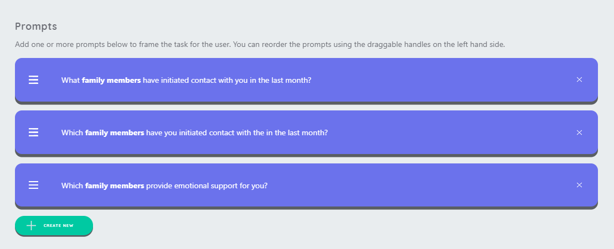
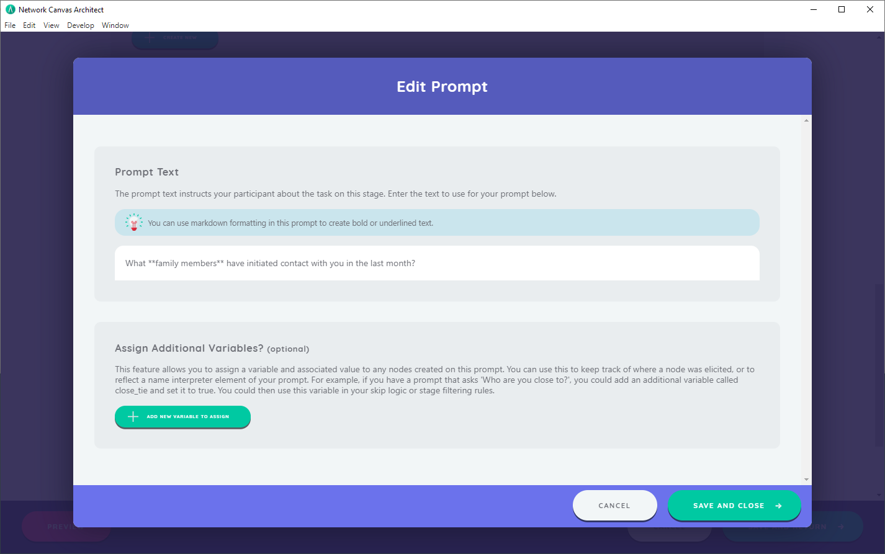

Most stages use the concept of “prompts” that define questions to put to the participant during the interview. This can be explained to the participant in ways that are meaningful to your study.

A single stage may contain multiple prompts, or a single prompt, depending on the needs of the interview. You may wish to think about grouping prompts by theme, and then having one stage for each theme. For example, a “Name Generator (family)” stage could contain prompts about family alters, and “Name Generator (colleagues)” could contain prompts about professional alters.

{:standalone}

## Creating prompts

When creating prompts, text instructions must be specified. Prompts can contain formatting such as bold or italicized text to create emphasis and rhythm. To create this formatting, use markdown syntax.

{:standalone}

Prompts can also be created to automatically assign "true" or "false" values to [additional variables](./additional-variables.md) to track where in an interview an entity was included, or to add to an entity.

## Prompts in Interviewer

Most stages use "pips" to indicate progress through the prompts, and the progress bar moves forward incrementally as the interview steps through each prompt.

{:standalone}
